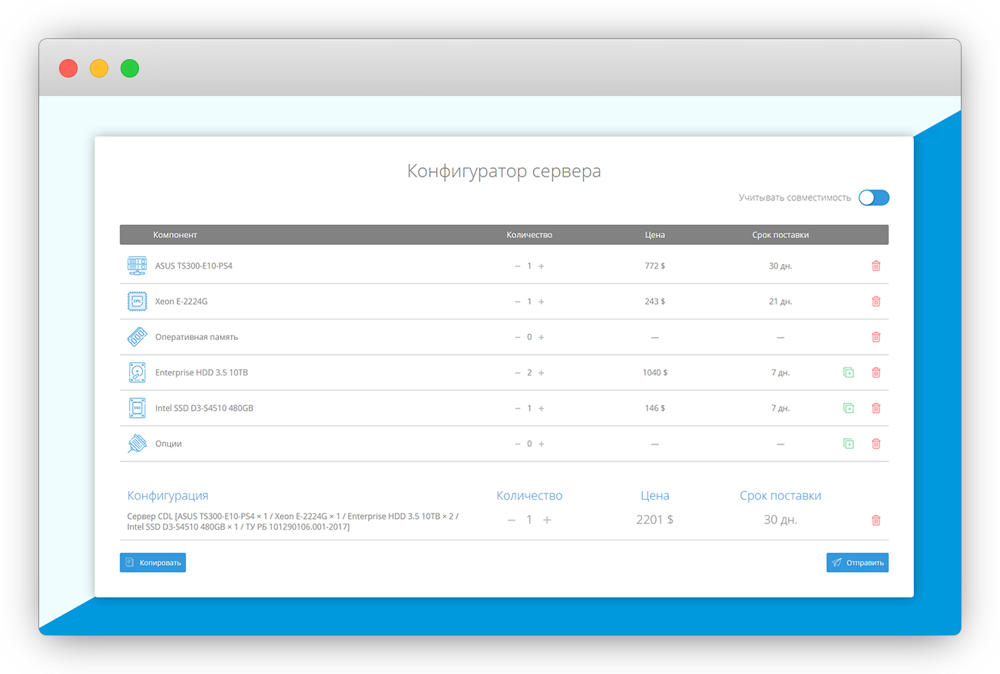
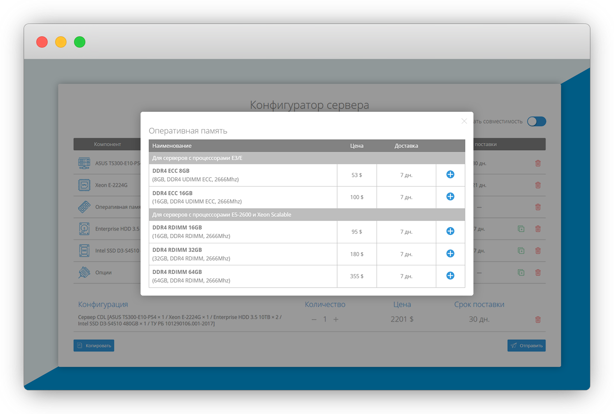
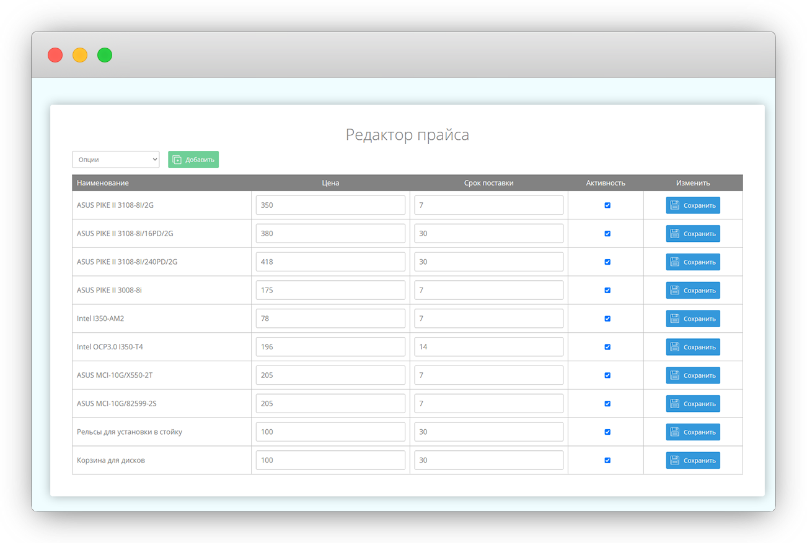
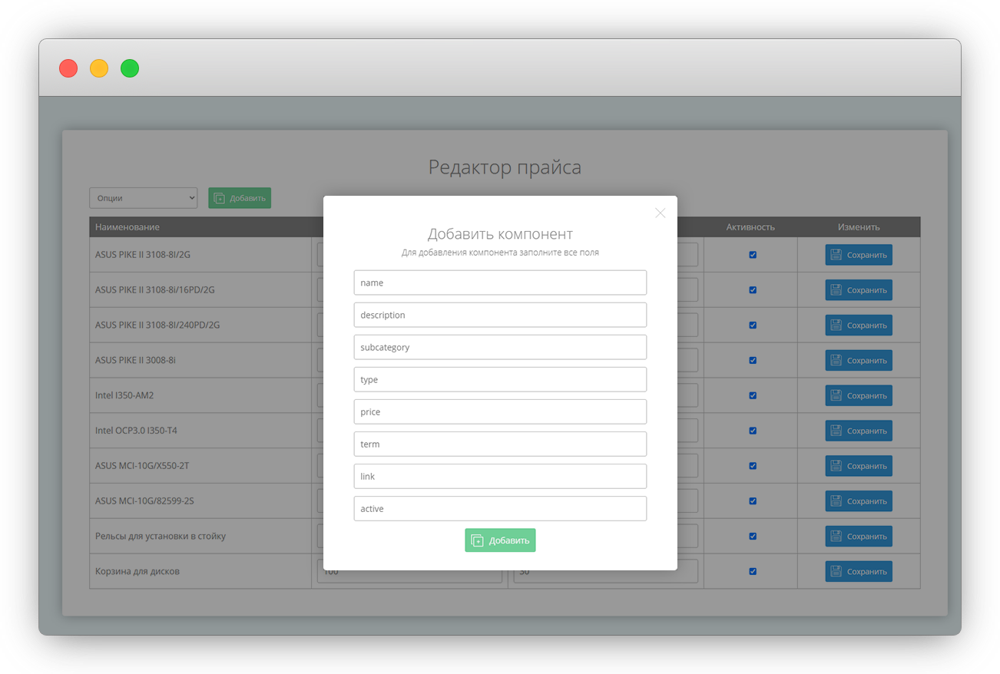

## Server Configurator App

Web application for configuring and ordering server equipment. App supports free or compatibility mode.

As a task, I got an Excel file with a list of components and formulas, and my job was to translate it into a web application. So I designed UI/UX and implemented logic using JS and PHP/MySQL.

Configurator App has a simple administration panel for managing the content.

